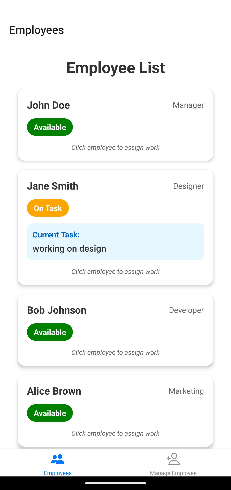

# Crew Management Program

## Overview

This program is for Mobile Applications Course - Assignment 1.
Created by: Mengyao Zhang.

Crew Management Program is a simple program that allows users to manage their crew members including assign works, check their work status, and add new crew members and delete existing ones.

## Features

1. Add New Crew Member: Users can add new crew members by entering their name, selecting role.
2. Delete Crew Member: Users can delete existing crew members by clicking on "Delete" button.
3. Assign Works: Users can assign works to crew members by clicking on their names and entering work details in modal dialog.
4. Complete Works: Users can complete works by clicking on "Complete" button in modal dialog.

## Requirements

    - Android Studio
    - Visual Studio Code

## Installation Instructions

### Installing with APK

1. Unzip the assignment file.
2. Open the folder and find the apk file.
3. Open devices manager in Android Studio.
4. Select a device and run.
5. Drag and drop the apk file into the device.
6. Enjoy!

### Installing with Source Code

1. Open Visual Studio Code.
2. Open the folder in Visual Studio Code.
3. Open terminal type the command:
   `npm install`
   `npm expo start:android`
4. Then it will show a QR code and automatically open the app on visual device.
5. Or use your Iphone to scan the QR code.

## Usage

1. When opening the app, you will see a welcome page, click on "Get Started" to enter the main page.
2. In the main page, you can see the list of crew members, their roles, and their work status.
3. Click on any crew member to open a modal dialog, either to assign works or complete works.
4. Click on "Manage Employees" Tab on the bottom of the page to go to the employee management page.
5. You can enter new crew members' information and add them to the list.
6. You also can delete existing crew members by clicking on "Delete" button of each crew member.
7. Either add or delete crew members, you will see the changes reflected in the main page.

## Screenshots

